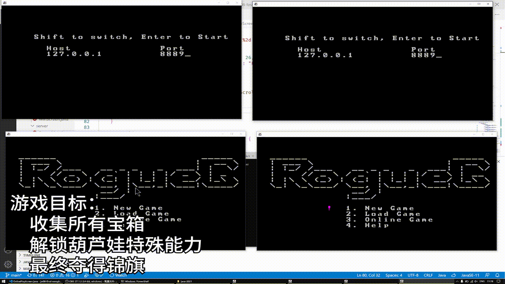

# 成果展示

# 游戏说明

## 游戏流程

- 在寻找7个葫芦娃的过程中，与地图中的普通怪物进行战斗，同时可以获得金币
- 在前六娃没有收集完毕之后，七娃才会出现
- 在找回七娃之后，BOSS就会出现
- 击败BOSS，游戏胜利
- 游戏过程中老头死亡都会导致游戏结束
- 游戏流程中可以存档

## 玩家角色

### 老头
- 没有任何战斗能力
- 老头死亡游戏结束
- 生命值较难恢复
### 葫芦娃
#### 葫芦娃的共有特性
- 拥有一定的战斗能力
- 死亡之后通过道具可以复活
- 生命值较容易恢复

#### 大娃
- 拥有基础的近距离战斗能力

#### 二娃
- 可以一段时间内获得全视野

#### 三娃
- 短时间的无敌状态
- 其间可以攻击（攻击力较低）
- 生命值较高

#### 四娃
- 线性AOE

#### 五娃
- 面积AOE

#### 六娃
- 长时间的无敌状态
- 其间不可以攻击
- 生命值较低

#### 七娃
- 仅仅作为剧情道具

#### 葫芦小金刚
- 无敌
- 范围AOE
- 较长的冷却时间

## 敌对生物
### 普通怪物
#### 共有特性
- 所有怪物的生命值都是3，用颜色（绿，黄，红）表示
#### 近战怪物
- 近战
- 攻击频率较高
#### 远距离攻击怪物
- 线性远距离
- 攻击频率较低
- 颜色闪烁准备攻击
#### AOE怪物
- 范围AOE攻击
- 攻击频率较低
- 颜色闪烁准备攻击

### BOSS
- 生命值采用较大的整数值，用游戏画面下面的血量条表示
- 合作技能：地图炮

#### 蛇精
- 冲刺
- 毒伤害（减速、持续伤害）

#### 蝎子精
- 回旋斧
- 召唤普通怪物

## 开发计划
1. 完成游戏流程
   - 玩家角色就是jw04的noob
   - 走完游戏的整个流程
   - 搭建之后开发的测试平台

2. 完成主人公和道具的交互
   - 葫芦娃的获得
   - 葫芦娃的切换
   - 葫芦娃技能的view

3. 完成怪物的view
   - 普通怪物的攻击和移动
     - 攻击使用随机算法
     - 移动使用到固定点的移动，类似于走迷宫
   - BOSS的攻击和移动
     - 攻击使用随机算法
     - 移动使用到固定点的移动，类似于走迷宫
   - 使用单线程的对象池

4. 完成主人公和怪物的交互
   - 不仅是view，还有背后的数据交互
   - 多线程的实现

5. 进一步完善……

## 1. 完成游戏流程

## 2. 主人公和道具的交互

### 道具
- 定义 `Bonus` 类

### `Creature` 应该修改的地方
- `attack` p用没有了，可以改
- `moveBy` 也应该修改，考虑以下两点：
  - 多线程
  - 攻击方式的变化，攻击不再是和移动相关的了

### 不同主人公的实现
- 共同点：
  - 可以拾取道具（和一般的 `Creature` 不同）
  - 拥有血量、移动能力……（和一般的 `Creature` 相同）
- 不同点：
  - 技能不同
  - 冷却时间不同
  - 打印方式不同（葫芦娃之间的颜色，葫芦娃和老头的字形）

对于切换不同的葫芦娃：
- 每一个关键道具解锁一个葫芦娃
- 老头的技能可以被视为空技能

综上，最合适的实现方式是：
- 定义一个玩家角色类 `Player extends Creature`：
  - 重载 `move`
  - 添加 `skill` 方法
  - 添加冷却时间、解锁情况
- 老头和不同葫芦娃，就是不同的 `Player` 的子类
- 在 `PlayScreen` 中，搞一个 `List<PLayer>`
- 切换键，就是在 `List` 里面来回切。对于未解锁的情况，就直接忽略，循环选择，只到遇到一个已解锁的（应该挺自然）
